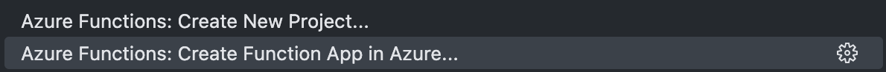
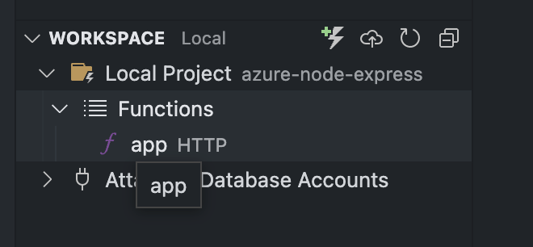

# Azure 

## Prerequisites 

https://learn.microsoft.com/en-us/azure/azure-functions/functions-develop-vs-code?tabs=csharp#prerequisites
- VScode
- Azure function extension
- An active Azure function

## Deployment

Create a new project and app function (one for each version you want to test v3 and v4)

You can find all the parameters in the function.json.
You should see the following configuration

All you have to do is click on "Deploy".
You can get the function URL from the Azure function extension.
